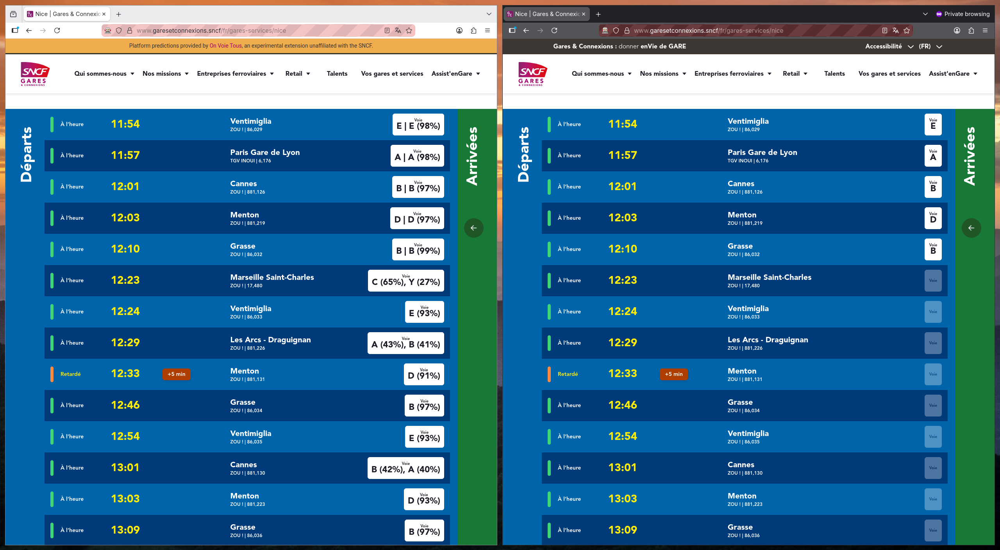

# On Voie Tous

Adds extra platform numbers to SNCF Gares & Connexions train departures, such as for [Lyon Part Dieu here](https://www.garesetconnexions.sncf/fr/gares-services/lyon-part-dieu/horaires).

SNCF Gares & Connexions doesn't show train platforms until very late, approx 20 minutes before departure. However, they know the platform number well in advance and even transmit some of this data to the browser. This Web Extension simply rewrites the flags on these platform numbers to hide them ensuring that the Gares & Connexions website shows them.

## Disclaimer

Sometimes the platform might change. You will notice when this happens because the train will not arrive at your platform.
