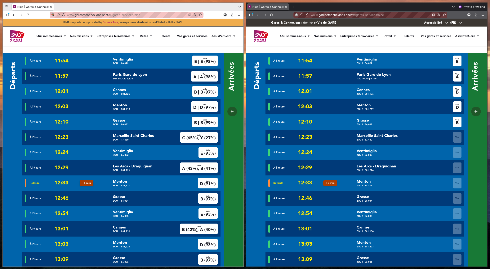

# On Voie Tous

Adds platform predictions to SNCF Gares & Connexions train departures, such as for [Lyon Part Dieu here](https://www.garesetconnexions.sncf/fr/gares-services/lyon-part-dieu/horaires).

SNCF Gares & Connexions doesn't show train platforms until very late, approx 20 minutes before departure. However, they know the platform number well in advance and _USED TO_ even transmit some of this data to the browser. This Web Extension simply ~~rewrites~~ rewrote the flags on these hidden platform numbers, ensuring that the Gares & Connexions website ~~shows~~ showed them.

However, SNCF Gares & Connexions got wind of this and stopped transmitting the platform numbers ahead of time. That's ok, c'est de bonne guerre. I am petty and stubborn enough to replace it with my own gradient-boosted tree model which you can find in predict/.

## Installation

Add to Firefox on desktop or Android from the [Firefox Add-ons Store](https://addons.mozilla.org/en-US/firefox/addon/on-voie-tous/). Users have reported that it also works on the Orion browser for iPhone.

For other browsers that support userscripts, if you have e.g. Tampermonkey installed, you can install the script directly by clicking this link: [content.user.js](https://raw.githubusercontent.com/bovine3dom/on_voie_tous/master/src/content.user.js)

## Disclaimer

Sometimes the platform might change. You will notice when this happens because the train will not arrive at your platform.

The model is a horrifically complicated black box and will occasionally come up with all kinds of mad stuff. But that's part of the fun of it right? The SNCF's own claimed platform, when they eventually deign to provide it, is shown before the pipe, e.g. "C | C (80%)".

The station you are looking at and a bunch of data about all the upcoming trains will be sent to a server I control. I pinky promise that I am not logging or storing any of this data, and I am specifically using POST rather than GET requests to make it harder for other people to log.

## Development

Run with

`scripts/run.sh`

Build for distribution with

`scripts/build.sh`

Testing on android:

1. plug in your phone
2. `adb devices`
3. allow usb debugging on phone
4. `scripts/run_android.sh [device id]`
5. make sure firefox settings -> usb debugging is enabled
6. test
